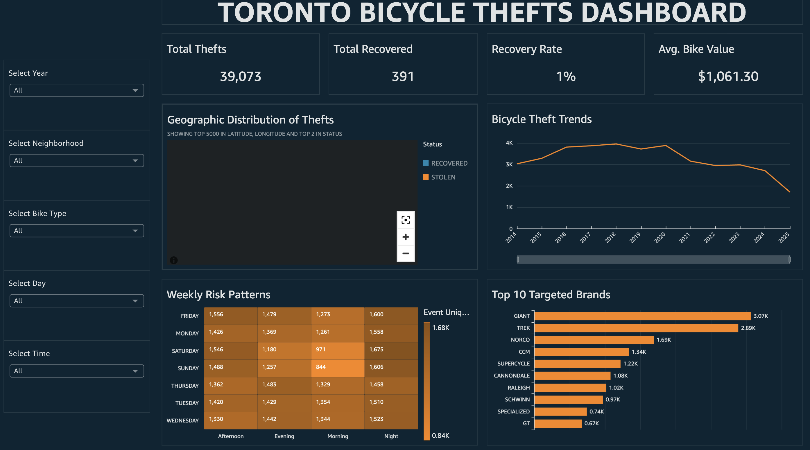
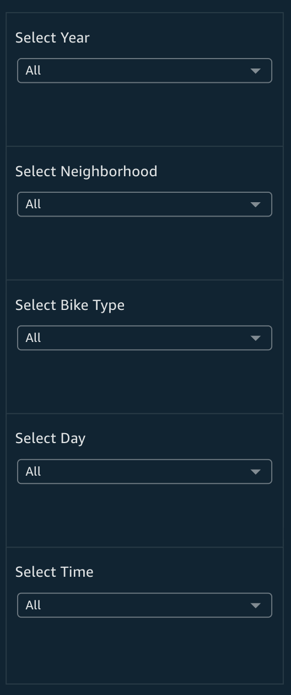
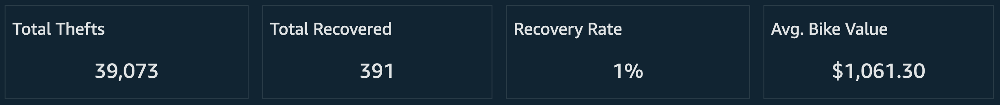
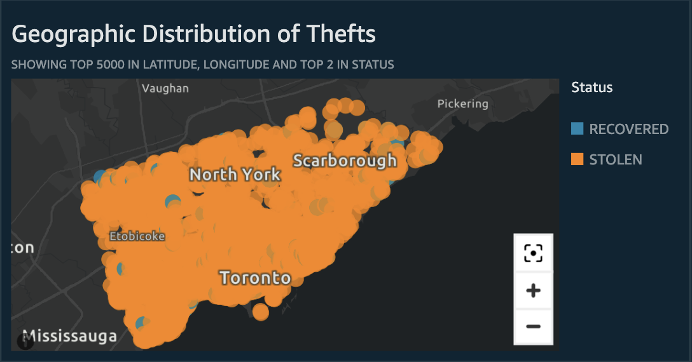
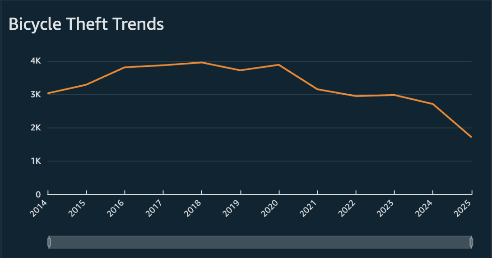
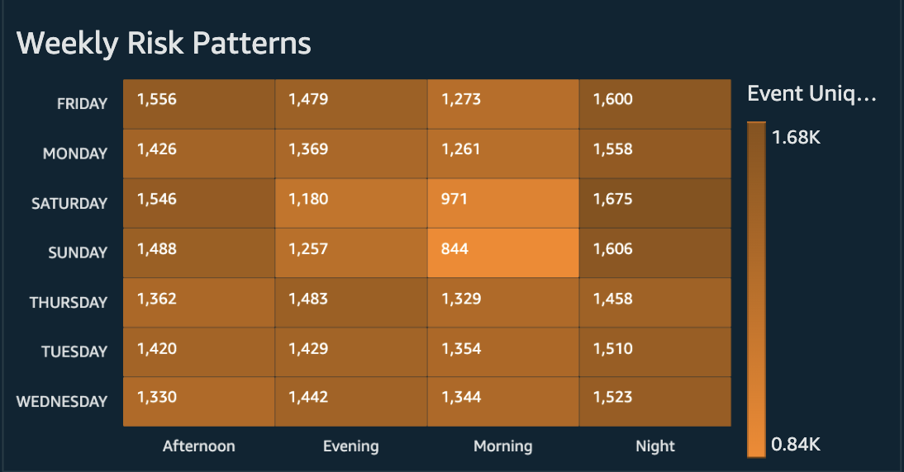
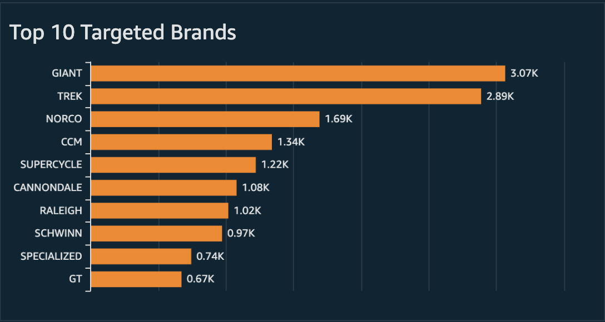

# Toronto Bicycle Thefts Data Analysis 🚲

An end-to-end data pipeline and analytics stack for analyzing [Toronto Bicycle Thefts](https://open.toronto.ca/dataset/bicycle-thefts/) using Apache Kafka, AWS services, and interactive dashboards.

## Problem Statement

Bike theft is a recurring problem in urban areas. While the Toronto Police Service publishes open data on bicycle thefts, the raw data isn't directly usable for analysis by non-technical users. This project transforms that raw data into actionable insights.

## Objectives

- Build a cloud-based pipeline that ingests, cleans, and stores bicycle theft data
- Enable analysis of theft patterns by location, time, bike characteristics, and recovery status
- Deliver interactive dashboards for cyclists, city planners, and law enforcement

## Key Questions Answered

- Which areas and police divisions have the most thefts?
- What are the peak times, days, and months for theft?
- Which bike types, colours, and price ranges are most targeted?
- How do recovery patterns vary across the city?
- What are the seasonal and time-of-day theft trends?
- Which bike brands are most frequently stolen and what are their recovery rates?

---

## Architecture


---

## Dataset

| Field | Description |
|-------|-------------|
| **Source** | City of Toronto Open Data |
| **Records** | ~39,000+ reported bicycle thefts (2014-2024) |
| **Link** | [Toronto Bicycle Thefts](https://open.toronto.ca/dataset/bicycle-thefts/) |

### Data Fields

- **Event Info:** Event ID, primary offence, occurrence/report dates, year, month, day, hour
- **Location:** Police division, location type, premises type
- **Bike Details:** Make, model, type, speed, colour, cost, status (STOLEN/RECOVERED)
- **Geospatial:** Longitude, latitude (WGS84)

---

## Tech Stack

| Category | Technologies |
|----------|--------------|
| **Languages** | Python 3.9+ |
| **Libraries** | kafka-python, pandas, boto3, python-dateutil |
| **Messaging** | Apache Kafka, ZooKeeper |
| **Compute** | Amazon EC2 |
| **Storage** | Amazon S3 |
| **Database** | Amazon RDS (MySQL) |
| **BI Tool** | Amazon QuickSight |
| **Security** | AWS IAM |

---

## Repository Structure
```
.
├── Data Architecture Diagram/
│   └── Toronto_Bicycle_Thefts_Data_Architecture.jpg  # Pipeline architecture diagram
├── Dataset/
│   └── bicycle-thefts-4326.csv                        # Raw Toronto Open Data CSV
├── Scripts/
│   ├── bicycle_thefts_producer.py                     # Kafka producer script
│   ├── bicycle_thefts_consumer.py                     # Kafka consumer + ETL script
│   └── bicycle_theft_analysis.sql                     # SQL queries and views
├── Dashboard_Visuals/
│   ├── behavioral_risk_heatmap.png                    # Day × Time heatmap
│   ├── dashboard_full_overview.png                    # Complete dashboard view
│   ├── geospatial_risk_map.png                        # Interactive theft map
│   ├── global_filter_controls.png                     # Global filter panel
│   ├── kpi_metrics_header.png                         # KPI metrics cockpit
│   ├── temporal_trend_analysis.png                    # Time-series trends
│   └── top_targeted_brands.png                        # Brand analysis chart
├── Data Analysis/
│   ├── Visuals/
│   │   ├── 01_peak_theft_hours.png                    # Hourly distribution
│   │   ├── 02_top_hotspots.png                        # Premises type breakdown
│   │   ├── 03_yearly_trends.png                       # Annual trends 2014-2024
│   │   ├── 04_stolen_bike_brands.png                  # Brand targeting analysis
│   │   ├── 05_seasonal_patterns.png                   # Monthly seasonality
│   │   ├── 06_location_type_risk.png                  # Location vulnerability
│   │   ├── 07_police_division_performance.png         # Division recovery rates
│   │   ├── 08_year_over_r_change.png                  # YoY percentage changes
│   │   ├── prevention_strategy_4pillar.png            # 4-pillar strategy diagram
│   │   └── risk_assessment_matrix.png                 # Risk assessment matrix
│   ├── bicycle_theft_analysis.sql                     # 15 queries + 6 views + master table
│   └── Key_Findings_Report.pdf                        # Analysis findings document
├── Report/
│   └── Toronto_Bicycle_Thefts_Final_Report.pdf       # Complete project report
├── Presentation/
│   └── Toronto_Bicycle_Thefts_Presentation.pdf       # Team presentation slides
└── README.md
```

---

## Getting Started

### Prerequisites

- AWS account with permissions for EC2, S3, RDS, IAM, and QuickSight
- Python 3.9+
- SSH access configured for EC2
- MySQL client (e.g., MySQL Workbench)

### 1. Clone the Repository
```bash
git clone https://github.com/CHAITANYAGANDI/toronto-bicycle-thefts-data-pipeline.git
cd toronto-bicycle-thefts-data-pipeline
```

### 2. EC2 Setup

Launch an EC2 instance (t3.xlarge recommended) and install dependencies:
```bash
# Install Java (required for Kafka)
sudo yum install java-1.8.0-openjdk -y

# Download and extract Kafka
wget https://archive.apache.org/dist/kafka/3.6.0/kafka_2.13-3.6.0.tgz
tar -xzf kafka_2.13-3.6.0.tgz
cd kafka_2.13-3.6.0

# Set JVM heap options
export KAFKA_HEAP_OPTS="-Xms1G -Xmx1G"
```

Update `config/server.properties`:
```properties
advertised.listeners=PLAINTEXT://<your-ec2-public-ip>:9092
```

Start ZooKeeper and Kafka:
```bash
bin/zookeeper-server-start.sh -daemon config/zookeeper.properties
bin/kafka-server-start.sh -daemon config/server.properties
```

### 3. Deploy Scripts to EC2
```bash
scp -i "bicycle-theft-ec2-key.pem" \
  Scripts/bicycle_thefts_producer.py \
  Scripts/bicycle_thefts_consumer.py \
  Dataset/bicycle-thefts-4326.csv \
  ec2-user@<your-ec2-public-ip>:/home/ec2-user/
```

---

## Running the Pipeline

### Set Environment Variables
```bash
export KAFKA_TOPIC="toronto_bicycle_thefts_project"
export KAFKA_BOOTSTRAP_SERVERS="<your-ec2-public-ip>:9092"
export S3_BUCKET="toronto-bicycle-thefts"
export S3_CLEAN_KEY="clean/Bicycle_Thefts_cleaned.csv"
export LOCAL_CLEAN_CSV="Bicycle_Thefts_cleaned.csv"
export KAFKA_GROUP_ID="bicycle-etl-group-v2"
```

### Run the Producer
```bash
python3 bicycle_thefts_producer.py
# Output: Finished sending 39473 messages to topic 'toronto_bicycle_thefts_project'
```

### Run the Consumer/ETL
```bash
python3 bicycle_thefts_consumer.py
# Consumes messages, cleans data, saves locally and uploads to S3
```

---

## RDS & QuickSight Setup

### RDS (MySQL)

1. Create an RDS MySQL instance in the same region as EC2
2. Configure security groups to allow MySQL access (port 3306)
3. Connect via MySQL Workbench and run:
```sql
-- Create database
CREATE DATABASE bicycle_thefts_db;
USE bicycle_thefts_db;

-- Load cleaned data into table
-- Run analysis queries from Data Analysis/bicycle_theft_analysis.sql
```

4. Load the cleaned CSV from S3 into the database

### SQL Analysis

The `Data Analysis/bicycle_theft_analysis.sql` file contains:

- **15 analytical queries** covering:
  - Temporal trends (yearly, monthly, daily, hourly patterns)
  - Geographic analysis (top theft hotspots, police division performance)
  - Bike attributes (most stolen brands, colors, types)
  - Advanced insights (seasonal patterns, year-over-year changes, recovery factors)

- **6 pre-built SQL views** for QuickSight:
  - `vw_hourly_thefts` - Hourly theft patterns
  - `vw_top_locations` - Top theft locations with recovery rates
  - `vw_yearly_trends` - Year-over-year theft trends
  - `vw_monthly_patterns` - Monthly theft patterns with bike values
  - `vw_bike_brands` - Bike brand analysis with recovery rates
  - `vw_division_performance` - Police division performance metrics

- **Master table view** (`vw_master_table`):
  - All original columns plus three computed columns:
    - `bike_make_clean` - Standardized bike brand names
    - `season` - Winter/Spring/Summer/Fall classification
    - `time_of_day` - Morning/Afternoon/Evening/Night classification
  - Designed for QuickSight with global filters and calculated fields

### 📊 BI & Visualization Layer (Amazon QuickSight)

The dashboard is built on a **"Single Pane of Glass"** architecture, utilizing a flattened "Master Table" to enable high-performance, in-memory analysis.

#### **Technical Implementation**
* **Data Modeling:** Implemented a single `vw_master_table` containing granular theft records enriched with `Time_of_Day`, `Season`, and standardized `Brand_Names`.
* **SPICE Optimization:** Utilized QuickSight's **SPICE** (Super-fast, Parallel, In-memory Calculation Engine) to cache the dataset, achieving sub-second load times for 10+ years of geospatial data.
* **Omni-Directional Interactivity:** Configured bi-directional "Filter Actions" on all visuals. Clicking a specific location on the map instantly filters the KPI cards, trend lines, and risk matrices.

#### **Dashboard Features**
* **Global Controls:** Implemented 5 global filters (Year, Neighborhood, Bike Type, Day, Time) to slice the entire dataset simultaneously.
* **Drill-Down Hierarchy:** Time-series charts enable one-click zooming from **Annual Trends** down to **Monthly Seasonality**.
* **Dynamic KPIs:** Top-row metrics (Volume, Recovery Rate, Economic Impact) instantly recalculate based on user interactions.

#### **Visual Gallery**

**1. The "Single Pane of Glass" Dashboard**
*(Fit to Window layout ensuring zero scrolling on any device)*


**2. Interactive Controls & KPIs**
*Top: 5-Factor Global Filter Bar. Bottom: Context-Aware KPI Cockpit.*
| Global Filter Controls | Dynamic KPI Header |
| :---: | :---: |
|  |  |

**3. Spatial & Temporal Analysis**
*Left: Geospatial clustering (Orange=Stolen, Blue=Recovered). Right: 10-Year Theft Trend with Drill-Down.*
| Geographic Distribution of Thefts | Bicycle Theft Trends |
| :---: | :---: |
|  |  |

**4. Behavioral Risk & Market Analysis**
*Left: Heatmap revealing "Danger Zones" (e.g., Friday Evenings). Right: Ranking of most stolen brands.*
| Weekly Risk Patterns (Heatmap) | Top 10 Targeted Brands |
| :---: | :---: |
|  |  |

## Key Findings

Detailed analysis findings are available in `Data Analysis/Key_Findings_Report.pdf`, including:

- **Declining trend**: Bicycle thefts decreased 9.06% in 2024, continuing multi-year downward trend
- **Peak risk periods**: Summer months (July: 5,996 thefts) and evening hours (6pm: 2,723 thefts)
- **High-risk locations**: Apartments (24.45%) and outdoor areas (29.40%) most vulnerable
- **Recovery crisis**: Less than 2% recovery rate across all police divisions
- **Brand targeting**: All bike brands at risk, with 'OT' and 'UK' categories accounting for 30.8% of thefts
- **Seasonal patterns**: Summer thefts 6x higher than winter months

---

## Team

| Member | Role | Responsibilities |
|--------|------|------------------|
| **Chaitanya Sai Gandi** | Cloud Infrastructure & ETL | EC2/Kafka setup, Python producer/consumer, data cleaning, S3 integration, architecture design |
| **Mudra Pandya** | Data Modeling & SQL Analysis | MySQL schema design, data loading, 15 analytical queries, SQL views creation, master table development, findings documentation |
| **Qi Han** | BI & Dashboards | QuickSight configuration, dashboard design, data visualization, insights storytelling |

---

## Contributing

This project was developed as part of DAMG 7370 coursework at Northeastern University.

---

## License

This project uses publicly available data from the City of Toronto Open Data Portal.

---

## Acknowledgments

- City of Toronto for providing open bicycle theft data
- Toronto Police Service for maintaining comprehensive theft records
- Professor Zheng for project guidance and support
